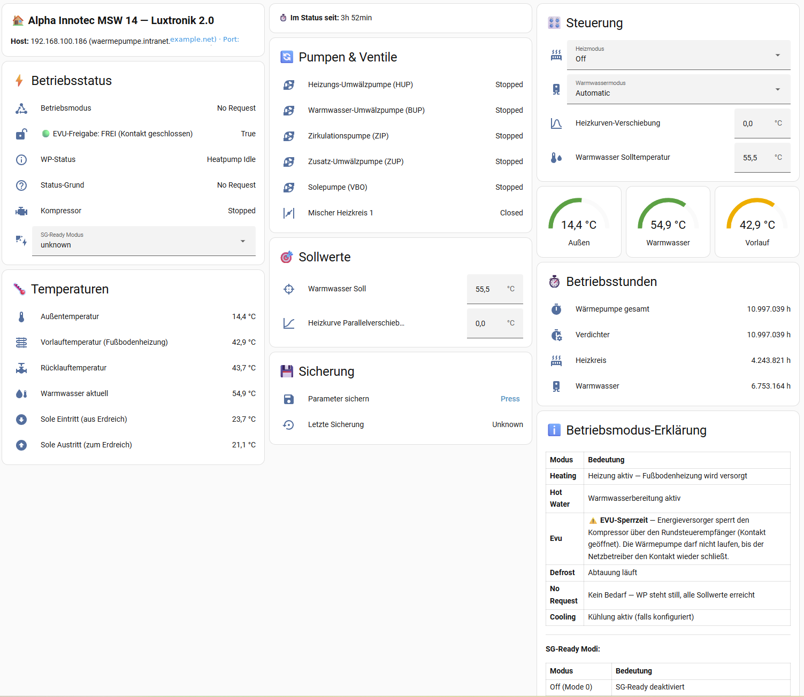

<!--
Schlüsselwörter: Luxtronik, Luxtronik 2.0, Wärmepumpe, Waermepumpe, Heat Pump,
Home Assistant, HACS, HACS Integration, Smart Home,
Alpha Innotec, Novelan, Buderus, Nibe, Roth, Elco, Wolf,
SG-Ready, Solar Boost, Energiemanagement, Solarüberschuss,
Modbus, Port 8889, Binärprotokoll,
Temperatursensor, Heizungssteuerung, Warmwasser, Brauchwasser,
Fußbodenheizung, Fussbodenheizung, Mehrschichtspeicher, Durchlauferhitzer,
Netzeinspeisung, Photovoltaik, PV Überschuss, evcc,
Nacht-Heizungspause, Badebooster, Bath Boost, heisses Bad, Warmwasser-Boost,
Warmwasser auf Knopfdruck, on-demand hot water,
Parameter-Sicherung, Parameter-Backup
-->

  

# Luxtronik 2.0 — Home Assistant Integration

**Home Assistant ist der primäre, aktiv gepflegte Weg, dieses Projekt zu nutzen.** Dieses Repository enthält eine HACS-Custom-Integration, die direkt mit Luxtronik‑2.0‑Wärmepumpensteuerungen kommuniziert und sie als Home‑Assistant‑Entities bereitstellt. Ein separater Modbus‑TCP‑Proxy existiert nur noch als nicht gepflegter Legacy‑Nebenschauplatz für Nutzer, die explizit rohen Modbus‑Zugriff benötigen.

Wenn du eine Luxtronik‑2.0‑Wärmepumpe von **Alpha Innotec, Novelan, Buderus, Nibe, Roth, Elco oder Wolf** besitzt, installiere die HACS‑Integration weiter unten — das ist der unterstützte Weg.

[English version → README.md](README.md)

---

## Drei Pfade

Dieses Projekt unterstützt drei Integrationspfade mit klar unterschiedlichem Reifegrad. Wähle den Pfad, der zu deinem Setup passt.

### Pfad 1: HACS Home Assistant Integration — ✅ Unterstützt

**Das ist der primäre Anwendungsfall und der einzige aktiv gepflegte Pfad.**

- Installation als HACS *Custom Repository* mit `https://github.com/notDIRK/luxtronik2-hass`
- Config‑Flow‑Oberfläche — nur die IP‑Adresse der Wärmepumpe eintragen, kein YAML
- **31+ Entities** verfügbar: Temperaturen, Betriebsmodi, Leistung, Status, Sollwerte, SG‑Ready
- Funktioniert mit Home Assistant **2024.1+** (getestet auf 2026.4.x)
- Python 3.12+ Laufzeit (entspricht HA Core)
- Spricht direkt mit der Wärmepumpe über die `luxtronik`-Bibliothek — keine zusätzlichen Dienste, keine Modbus‑Schicht

**Installation:**

1. In Home Assistant → HACS → Integrationen → ⋮ Menü → *Benutzerdefinierte Repositories*
2. `https://github.com/notDIRK/luxtronik2-hass` mit Kategorie **Integration** hinzufügen
3. **Luxtronik 2.0 (Home Assistant)** installieren
4. Home Assistant neu starten
5. Einstellungen → Geräte & Dienste → *Integration hinzufügen* → nach **Luxtronik 2.0** suchen
6. IP‑Adresse deiner Wärmepumpensteuerung eingeben

### Pfad 2: Legacy Modbus TCP Proxy — ⚠️ Experimentell

**Nicht gepflegter Legacy‑Nebenschauplatz.** Dieser existierte als eigenständiger Proxy vor der HACS‑Integration. Er wird nicht mehr aktiv gepflegt und lebt in einem separaten **archivierten** Repository.

Nutze diesen Pfad **nur**, wenn du explizit rohen Modbus‑TCP‑Zugriff brauchst — zum Beispiel für die Integration mit `evcc` oder einem anderen Modbus‑only‑Tool, das Home Assistant nicht ansprechen kann.

- Repository: [notDIRK/luxtronik2-modbus-proxy](https://github.com/notDIRK/luxtronik2-modbus-proxy) (archiviert, schreibgeschützt)
- Status: ⚠️ Experimentell — keine Bugfixes, keine neuen Features, kein Support
- Technologie: Python‑Proxy, der das Luxtronik‑Binärprotokoll (Port 8889) nach Modbus TCP (Port 502) übersetzt

Falls du den Proxy aktuell **zusammen mit** der HACS‑Integration betreibst, solltest du vollständig auf Pfad 1 migrieren — die Integration deckt alle Entities ab, die der Proxy bereitgestellt hat, und vermeidet den Single‑Connection‑Engpass.

### Pfad 3: Home Assistant Add‑on — 📋 Geplant für v1.3

Ein vollwertiges Home‑Assistant‑Add‑on (für HA OS und Supervised‑Installationen) ist **für v1.3 geplant**. Es wird die Integration als Supervisor‑Add‑on paketieren, sodass HA‑OS‑Nutzer es ohne HACS installieren können.

Dieser Pfad ist **noch nicht verfügbar**. Den Fortschritt kannst du in den Repository‑Meilensteinen verfolgen.

---

## Funktionen (Pfad 1 — HACS‑Integration)

- **Lese‑Sensoren**: Vor‑/Rücklauftemperatur, Außentemperatur, Warmwassertemperatur, Betriebsstunden, Stromverbrauch, Fehlerzustände, SG‑Ready‑Status
- **Steuer‑Entities**: Heizmodus, Warmwassermodus, SG‑Ready‑Modus, Temperatur‑Sollwerte
- **[Badebooster (Bath Boost)](#badebooster-bath-boost)**: Warmwasser auf Knopfdruck mit Fortschrittsanzeige — [Details unten](#badebooster-bath-boost)
- **[Smart Energy](#smart-energy)**: Solar Boost + Nacht-Heizungspause — [Details unten](#smart-energy)
- **Schreibratenbegrenzung** zum Schutz der Steuerung vor Befehlsfluten
- **Single‑Connection‑sicher**: respektiert die One‑TCP‑Connection‑Beschränkung von Luxtronik 2.0 über Connect‑per‑Call + asyncio‑Lock
- **Englische und deutsche Übersetzungen** eingebaut
- **Stabile Entity‑IDs**: Entities verwenden das Gerätenamen‑Präfix `luxtronik_2_0_*` — sie ändern sich nicht, wenn die Integration umbenannt wird

### Dashboard-Vorschau

### Dashboard einrichten

Ein fertiges Dashboard-YAML ist in diesem Repository enthalten. So richtest du es ein:

1. In Home Assistant: **Einstellungen → Dashboards → Dashboard hinzufügen**
2. Name vergeben (z.B. "Waermepumpe") und Icon wählen (`mdi:heat-pump`)
3. Neues Dashboard öffnen → **⋮** (oben rechts) → **Dashboard bearbeiten** → **⋮** → **Roher Konfigurationseditor**
4. Den gesamten Inhalt durch das YAML aus [`docs/examples/dashboard-waermepumpe.yaml`](docs/examples/dashboard-waermepumpe.yaml) ersetzen
5. In Zeile 11 `your-heatpump-ip` durch die tatsächliche IP-Adresse deiner Wärmepumpe ersetzen
6. **Speichern** klicken, dann **Fertig**

Das Dashboard zeigt Betriebsstatus, Temperaturen, Pumpenzustaende, Betriebsstunden, Sollwerte, Smart Energy Steuerung und einen 24-Stunden-Netz-Verlaufsgraphen — alles mit den stabilen `luxtronik_2_0_*` Entity-IDs.

**Zwei Dashboard-Sprachen verfuegbar:**

| Sprache | Datei | Beschreibung |
|---------|-------|-------------|
| **Deutsch** | [dashboard-waermepumpe.yaml](docs/examples/dashboard-waermepumpe.yaml) | Alle Beschriftungen auf Deutsch |
| **English** | [dashboard-heatpump-en.yaml](docs/examples/dashboard-heatpump-en.yaml) | All labels and descriptions in English |
| **Badebooster** | [dashboard-bath-boost.yaml](docs/examples/dashboard-bath-boost.yaml) | Einzelne Kachel mit Fortschrittsanzeige (zu jedem Dashboard hinzufuegbar) |

Waehle das Dashboard passend zu deiner Home Assistant Spracheinstellung.

---

## Badebooster (Bath Boost)

**Ein Knopf fuer ein heisses Bad.** Druecke den Badebooster-Button und die Waermepumpe heizt sofort den Warmwasserspeicher auf eine hoehere Zieltemperatur auf. Sobald die Temperatur erreicht ist, wird alles automatisch auf Normal zurueckgestellt.

**Schnellstart:**
1. Finde den **Badebooster**-Button auf der Geraeteseite (Geraete & Dienste > Luxtronik 2.0 > Geraet)
2. Druecke ihn — fertig. Die Waermepumpe heizt sofort auf.
3. Verfolge den Fortschritt im **Badebooster Status**-Sensor

**So funktioniert es:**

| Schritt | Was passiert |
|---------|-------------|
| Button gedrueckt | Warmwassermodus wechselt auf „Party" (erzwingt sofortiges Aufheizen), Solltemperatur wird auf Zielwert angehoben |
| Aufheizen laeuft | Status-Sensor zeigt „Aktiv" mit aktueller Temperatur, Fortschritt in % und geschaetzter Restzeit |
| Ziel erreicht | Modus wechselt automatisch zurueck auf „Automatik", Solltemperatur wird auf Normal zurueckgestellt |

**Standardtemperaturen:**

| Einstellung | Standard | Bereich | Wo aendern |
|-------------|----------|---------|------------|
| Zieltemperatur | 65,0 °C | 40–70 °C | Einstellungen > Luxtronik 2.0 > Konfigurieren > Badebooster |
| Normaltemperatur | 55,5 °C | 30–65 °C | Einstellungen > Luxtronik 2.0 > Konfigurieren > Badebooster |

**Erzeugte Entities:**

| Entity | Typ | Beschreibung |
|--------|-----|-------------|
| `button.luxtronik_2_0_badebooster` | Button | Druecken zum Starten |
| `sensor.luxtronik_2_0_badebooster_status` | Sensor | Zeigt „Aktiv" oder „Bereit" mit Fortschritts-Attributen |

Der Status-Sensor liefert waehrend des Boosts diese Attribute: `current_temperature`, `target_temperature`, `progress_percent`, `estimated_remaining_minutes`, `activated_at`.

**Dashboard-Kachel:** Eine fertige Dashboard-Kachel liegt unter [`docs/examples/dashboard-bath-boost.yaml`](docs/examples/dashboard-bath-boost.yaml). Siehe [Dashboard einrichten](#dashboard-einrichten) fuer das Hinzufuegen von Kacheln.

> **Hinweis:** Der Badebooster hat Vorrang vor Solar Boost. Wenn Solar Boost aktiv ist und du den Badebooster drueckst, gewinnt deine manuelle Anfrage.

---

## Smart Energy

Zwei optionale Automatisierungsfunktionen fuer Waermepumpen mit **Mehrschichtspeicher und Warmwasser-Durchlauferhitzer**. Beide koennen unabhaengig aktiviert werden ueber **Einstellungen → Geraete & Dienste → Luxtronik 2.0 → Konfigurieren**.

### Solar Boost

Erhoeht automatisch die Warmwasser-Solltemperatur wenn die Solaranlage ueberschuessigen Strom ins Netz einspeist — kostenlose Solarenergie wird im Speicher gespeichert statt sie zu verkaufen.

- **Ausloeser:** Netzeinspeisung uebersteigt konfigurierbaren Schwellwert (Standard: 1500 W)
- **Aktion:** Warmwasser-Soll wird von Normal (Standard: 55,5 °C) auf Boost-Temperatur angehoben (Standard: 65,0 °C)
- **Mindestlaufzeit:** Einmal aktiviert, bleibt der Boost fuer eine konfigurierbare Dauer aktiv (Standard: 30 Min.) um schnelles Ein/Aus bei Wolkendurchzug zu vermeiden
- **Netz-Sensor Konvention:** Positive Werte = Netzbezug (Verbrauch), negative Werte = Einspeisung (Verkauf). Beispiel: `sensor.grid_total = -2000` bedeutet 2000 W Einspeisung

**Dashboard-Visualisierung:**

| Symbol | Bedeutung |
|--------|-----------|
| 🔌 **Netzbezug: 1078 W** | Strom aus dem Netz (positiver Wert) |
| ☀️ **Einspeisung: 2000 W** | Strom ins Netz (negativer Wert) |
| 🟢 Boost-Bedingung erfuellt | Einspeisung > Schwellwert |
| 🟡 Unter Schwellwert | Einspeisung vorhanden aber unter Schwellwert |
| 🔴 Kein Solarueberschuss | Netzbezug |

### Nacht-Heizungspause

Schaltet die Fussbodenheizung nachts automatisch ab, damit der Heizkreis den Speicher nicht ueber Nacht abkuehlt. So bleibt genuegend Warmwasser fuer den Morgen erhalten — entscheidend bei Systemen wo Fussbodenheizung und Warmwasser denselben Speicher teilen.

- **Standard-Zeitfenster:** 18:00 – 09:00 (konfigurierbar)
- **Aktion:** Heizmodus wird waehrend des Zeitfensters auf „Aus" gesetzt, ausserhalb auf „Automatik" zurueckgestellt
- **Warum:** Bei einem Mehrschichtspeicher mit Warmwasser-Durchlauferhitzer kann die Fussbodenheizung den Speicher ueber Nacht entleeren — morgens steht dann kein Warmwasser mehr zur Verfuegung

### Konfiguration

Alle Funktionen werden im Options-Flow der Integration konfiguriert:

1. **Einstellungen → Geraete & Dienste → Luxtronik 2.0 → Konfigurieren**
2. **Solar Boost**, **Nacht-Heizungspause** oder **Badebooster** aus dem Menue waehlen
3. Funktion aktivieren und Schwellwerte/Temperaturen/Zeiten anpassen
4. Das Dashboard zeigt Toggle-Schalter, Netz-Status und einen 24-Stunden-Verlaufsgraphen

Smart-Energy-Schalter koennen auch zur Laufzeit ueber die Switch-Entities umgeschaltet werden (`switch.luxtronik_2_0_solar_boost`, `switch.luxtronik_2_0_nacht_heizungspause`).

## Voraussetzungen

- Home Assistant **2024.1** oder neuer
- Eine im LAN erreichbare Luxtronik‑2.0‑Wärmepumpensteuerung
- Die IP‑Adresse der Wärmepumpe

## Kompatible Wärmepumpen

Alle Wärmepumpen mit Luxtronik‑2.0‑Steuerung, unter anderem Modelle von:

- Alpha Innotec
- Novelan
- Buderus (ausgewählte Modelle)
- Nibe (ausgewählte Modelle)
- Roth
- Elco
- Wolf

Wenn dein Gerät älter als Luxtronik 2.1 ist und keinen Firmware‑Upgrade‑Pfad hat, ist diese Integration für dich.

## Migration von v1.1

Falls du zuvor die alte `luxtronik2_modbus_proxy`‑HACS‑Integration (v1.1) verwendet hast, siehe **[MIGRATION.md](MIGRATION.md)** für die schrittweise Anleitung. Deine sichtbaren Entity‑IDs bleiben beim Upgrade stabil, weil sie vom Gerätenamen‑Slug abgeleitet werden, nicht vom Integrations‑Domain.

## Support

- Probleme: [GitHub Issues](https://github.com/notDIRK/luxtronik2-hass/issues)
- Diskussionen: [GitHub Discussions](https://github.com/notDIRK/luxtronik2-hass/discussions)

## Lizenz

[MIT](LICENSE) — passend zum Ökosystem der `luxtronik`‑Bibliothek.

## Danksagung

- [`luxtronik`](https://github.com/Bouni/python-luxtronik)‑Bibliothek von Bouni — der Binärprotokoll‑Client, auf dem diese Integration aufbaut
- Die Home‑Assistant‑Community
